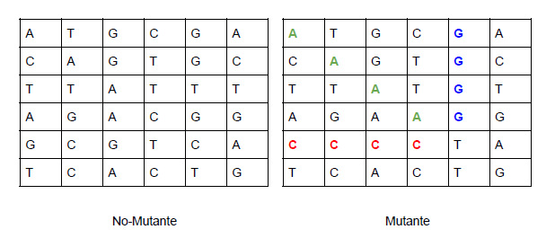

# Mutantes

**Desafio:**

Magneto quiere reclutar la mayor cantidad de mutantes para poder luchar
contra los X-Men.
EL API de este proyecto verifica si una secuencia de ADN es de 
humano o es mutante.

Se recibira como parámetro un array de Strings que representan cada fila de una tabla
de (NxN) con la secuencia del ADN. Las letras de los Strings solo pueden ser: (A,T,C,G), las
cuales representa cada base nitrogenada del ADN.

Sabrás si un humano es mutante, si encuentras más de una secuencia de cuatro letras
iguales , de forma oblicua, horizontal o vertical.
Ejemplo (Caso mutante):
String[] dna = {"ATGCGA","CAGTGC","TTATGT","AGAAGG","CCCCTA","TCACTG"};
En este caso el llamado a la función isMutant(dna) devuelve “true”.

