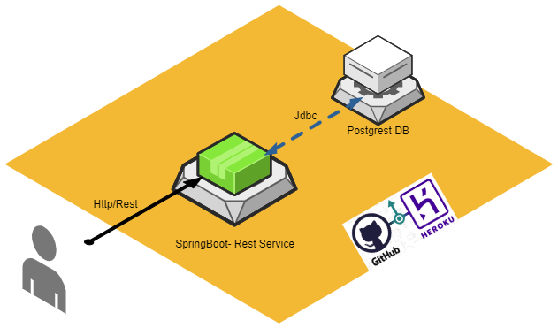
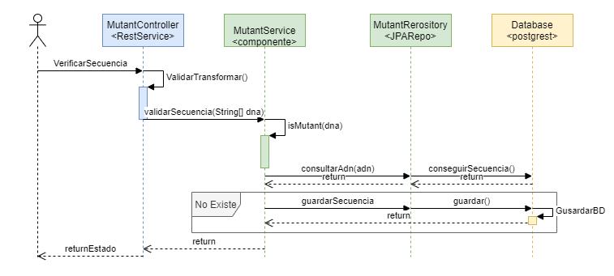
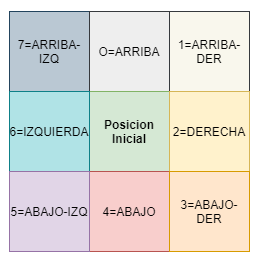
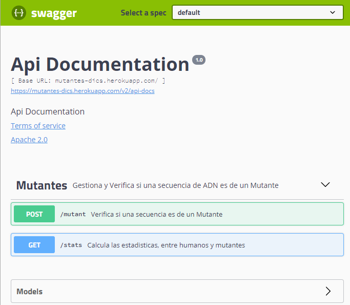

# Mutantes

**Desafio:**

Magneto quiere reclutar la mayor cantidad de mutantes para poder luchar
contra los X-Men.
EL API de este proyecto verifica si una secuencia de ADN es de 
humano o es mutante.

Se recibira como parámetro un array de Strings que representan cada fila de una tabla
de (NxN) con la secuencia del ADN. Las letras de los Strings solo pueden ser: (A,T,C,G), las
cuales representa cada base nitrogenada del ADN.

Sabrás si un humano es mutante, si encuentras más de una secuencia de cuatro letras
iguales , de forma oblicua, horizontal o vertical.
Ejemplo (Caso mutante):
String[] dna = {"ATGCGA","CAGTGC","TTATGT","AGAAGG","CCCCTA","TCACTG"};
En este caso el llamado a la función isMutant(dna) devuelve “true”.

**Diseño de la Solucion**

Los componentes principales son los siguientes:

- Servicio Rest (Java - Spring boot)
- Base de Datos (Postgrest)
- Plataforma de despliegue - Heroku - GitHub

**Diagrama de Secuencia**

Se expone un Servicio REST con los siguientes recursos:

- **POST /mutant**  Verifica si una secuencia es de un Mutante
- **GET /stats**    Calcula las estadisticas, entre humanos y mutantes

Se tieine una arquitectura convencional en n capas, capa controller / services /repository
cada una encargada de una responsabilidad especifica.

En la capa service, se maneja la logica para evaluar si una secuencia de adn (array de strings)  contiene las secuencias de los mutantes.
Esto lo realiza el metodo **isMutant(dna)**.

# Algoritmo Principal #

Se utiliza un algoritmo para recorrer la secuencia verificando que la palabra a buscar no supera la longitud del la matriz (matriz de Strings de la secuencia del adn).
Posteriormente se busca en todas las direcciones , en el sentido de las manecillas del reloj como muestra la imagen. Hasta que se encuentra la palabra a buscar o se recorre la matriz de la secuencia.

 

# Api Mutantes  (Swagger) #

Se documento el API  con **Swagger**, se puede consultar y ejecutar directamente  la url de despliegue de la aplicacion.

La aplicacion se encuentra desplegada en Heroku:

[https://mutantes-dics.herokuapp.com/](https://mutantes-dics.herokuapp.com/ "https://mutantes-dics.herokuapp.com/")  (Dado que esta desplegado en la capa gratuita, se debe ejecutar la url principal  la primera vez, para que inicie)

**API - Swagger:**

[https://mutantes-dics.herokuapp.com/swagger-ui.html](https://mutantes-dics.herokuapp.com/swagger-ui.html "https://mutantes-dics.herokuapp.com/swagger-ui.html")

Recursos:

- POST 
https://mutantes-dics.herokuapp.com/mutant

`curl -X POST "https://mutantes-dics.herokuapp.com/mutant" -H "accept: */*" -H "Content-Type: application/json" -d "{ \"dna\": [ \"ACCGA\", \"CAGTGC\", \"TTATGT\", \"AGAATG\", \"CCCCTA\", \"TCACTG\" ]}"`

- GET
https://mutantes-dics.herokuapp.com/stats

`curl -X GET "https://mutantes-dics.herokuapp.com/stats" -H "accept: */*"`

# Ejecucion - Desplegable #

Se puede ejecutar directamente el FAT , jar de Spring(tomcat Embebido)

Descargar (<a href="https://drive.google.com/file/d/1JEgFAsk4wcRtj7ZfCMBakVupKfRo3uEH/view?usp=sharing"  target="_blank">Desplegable.zip</a>)

Descomprimir y Ejecutar el siguiente comando (estando en la ruta donde esta el jar):

`java -jar -Dspring.profiles.active=dev GestionADN-1.0.0.jar`   

Antes de ejecutar configurar el archivo de propiedades 
**config/application-dev.properties** , segun corresponda.

Propiedades:

`server.port=${$PORT:8081}`  //Puerto donde arranca el servidor

`spring.datasource.driverClassName=org.postgresql.Driver`  

`spring.datasource.url=${JDBC_DATABASE_URL:jdbc:postgresql://localhost:5432/db}`  //Datos de la BD (postgrest)

`spring.datasource.username=${JDBC_DATABASE_USERNAME:user}`

`spring.datasource.password=${JDBC_DATABASE_PASSWORD:dics}`

